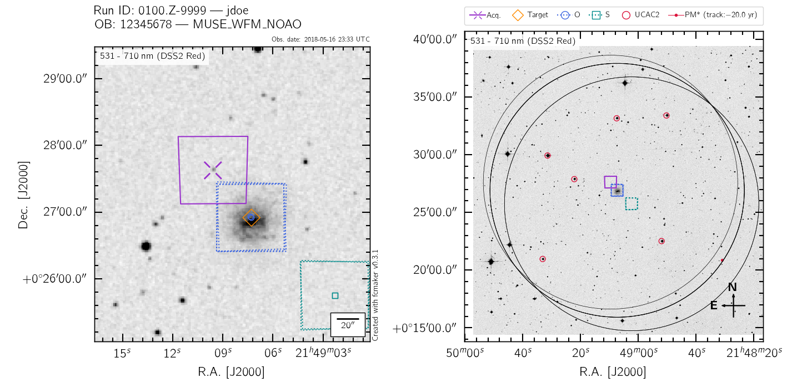
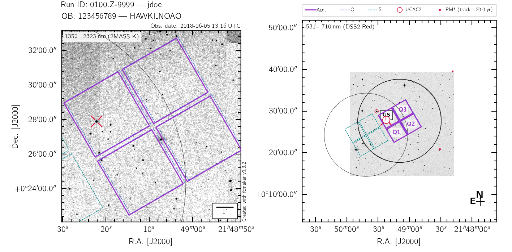
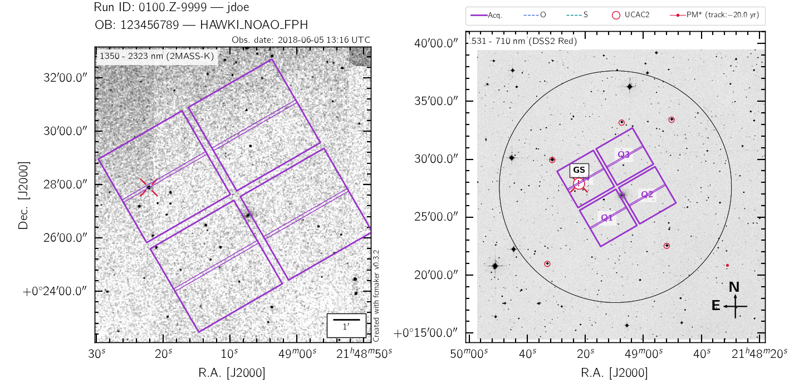
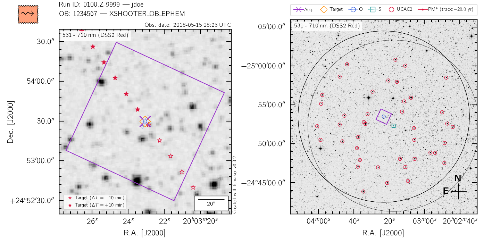
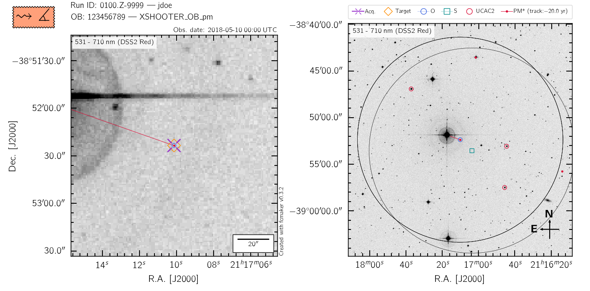

.. _gallery:

Gallery
=======

All the fcmaker finding charts share common elements. They are:

 - **two plots per finding chart:** a zoom-in view on the left, and a global view on the right. 
 - **a right panel aimed at the telescope operator:** it always uses DSS2 Red images for the 
   background. 
   
   + Black circles mark the outer validity area for Guide Stars: 11 arcmin in radius for the Nasmyth focus, 7.4 arcmin in radius for the Cassegrain focus.
   + All suitable UCAC2 stars with 11<UCmag<14 are tagged with red circles: these 
     stars are the ones that fit the nominal VLT GS specifications, and can be readily 
     selected by the Telescope Operator during the OB acquisition. Only the UCAC2 stars 
     compatible with all the OB offsets are tagged. 
   + If specified, the user-selected Guide Star is shown, and flagged accordingly if it 
     is unsuitable for any of the offset positions. 
   + Any star with large proper motion (where large is by default greater than 100 mas/year 
     according to GAIA DR2, set in ``fcm_m.min_abs_GAIA_pm``) is drawn, together with a 
     20 year look-back track (set in ``fcm_m.pm_track_time``) derived with the
     ``astropy.coordinates.SkyCoord.appl_space_motion()`` routine.
     
 - **a left panel aimed at the night astronomer:** the background image is instrument  
   dependant, and can be chosen/provided by the user. 
   
   + The acquisition field is shown in bold purple. 
   + In case of moving targets (with an ephemeris file), the target position within
     :math:`\pm` 2 hours (default, set in ``fcm_m.ephem_range``) from the ``obsdate`` parameter are 
     shown with red stars. Each time entry within the ephemeris file is shown individually.
     The target position at the chosen ``obsdate`` is propagated from the closest ephemeris 
     point in time using the ``astropy.coordinates.SkyCoord.appl_space_motion()`` routine. 
      
   + In case of moving targets (with proper motions in arcsec/year), the target coordinates
     at ``obsdate`` are also derived with the ``astropy.coordinates.SkyCoord.appl_space_motion()`` 
     routine. **This is not how the VLT will compute the target coordinates, instead 
     assuming that it moves along a Great Circle on the sky**. The implied error should 
     however remain negligible for most cases, and even more so if the epoch of the target 
     is recent.

Below are some typical examples of fcmaker finding charts for all the supported instruments,
along with a brief description of each chart specificities.

MUSE
----

MUSE WFM-NOAO
.............

The MUSE finding charts in NOAO mode show the location of the *target* defined in the OB, 
the acquisition field, and the subsequent O and S fields. The minimum valid radius for 
telescope Guide Stars is 120 arcsec from any offset position. 

To recreate this example finding chart, download 
:download:`local_2_fcm.muse_wfm-noao.txt <./local_2_fcm.muse_wfm-noao-pm.txt>` and run::
   
   python -m fcmaker -l -f local_2_fcm.muse_wfm-noao-pm.txt --do-png --systemtex

MUSE WFM-AO
...........

In addition to the elements of the MUSE NOAO charts, the AO charts display the validity 
area for the Tip-Tilt stars for all OB offsets (incl. the target itself, which is when the
AO loop is first closed). If one of the TTS falls outside of the suitable area for any of
the offset position, it is flagged with ``!``. 

.. figure:: ./fcm_plots/MUSE_WFM_AO_DSS2-Red.png
    :width: 750px
    :align: center
    :alt: MUSE WFM AO

To recreate this example finding chart, download 
:download:`local_2_fcm.muse_wfm-ao.txt <./local_2_fcm.muse_wfm-ao.txt>` and run::
   
   python -m fcmaker -l -f local_2_fcm.muse_wfm-ao.txt --do-png --systemtex

.. _examples-NFM:

MUSE NFM
...........

In addition to the elements of the MUSE WFM-NOAO charts, the NFM charts display the 
validity area for the on-axis Tip-Tilt star for all OB offsets (incl. the target itself, 
which is when the AO loop is first closed). If the on-axis TT star falls outside of the 
suitable area for any of the offset position, it is flagged with ``!``. 

By default, the background image for the MUSE NFM finding charts is a mock image of the sky
reconstructed from the Gaia catalogue (see :ref:`gaia-images`). The two finding charts 
below illustrate the benefit of this approach, in comparison with using a DSS2 Red image.

.. figure:: ./fcm_plots/MUSE_NFM_Gaia.png
    :width: 750px
    :align: center
    :alt: MUSE NFM

.. figure:: ./fcm_plots/MUSE_NFM_DSS2-Red.png
    :width: 750px
    :align: center
    :alt: MUSE NFM DSS2

To recreate these example finding charts, download 
:download:`local_2_fcm.muse_nfm-Gaia.txt <./local_2_fcm.muse_nfm-Gaia.txt>` and/or 
:download:`local_2_fcm.muse_nfm-DSS.txt <./local_2_fcm.muse_nfm-DSS.txt>` and 
run::
   
   python -m fcmaker -l -f local_2_fcm.muse_nfm-Gaia.txt --do-png --systemtex
   python -m fcmaker -l -f local_2_fcm.muse_nfm-DSS.txt --do-png --systemtex
   

HAWKI
-----

HAWKI NOAO & AO
...............

The HAWKI finding charts in NOAO mode show the acquisition field, and the subsequent O and 
S fields if the ``HAWKI_img_obs_GenericOffset`` template is used. All other templates, 
relying on unpredictable jitter offsets, will be simply ignored by fcmaker. The minimum 
valid radius for telescope Guide Stars is 240 arcsec from any offset position. HAWKI AO 
is currently offered in tip-tilt-free mode only, so that AO finding charts are 
undistinguishable from NOAO ones.

To recreate this example finding chart, download 
:download:`local_2_fcm.hawki_noao.txt <./local_2_fcm.hawki_noao.txt>` and run::
   
   python -m fcmaker -l -f local_2_fcm.hawki_noao.txt --do-png --systemtex

HAWKI FastPhot
...................

In addition to the elements of the HAWKI NOAO charts, the FastPhot charts display the  
detector windowed area. 

To recreate this example finding chart, download 
:download:`local_2_fcm.hawki_fph.txt <./local_2_fcm.hawki_fph.txt>` and run::
   
   python -m fcmaker -l -f local_2_fcm.hawki_fph.txt --do-png --systemtex

XSHOOTER
--------
The XSHOOTER finding charts show the field-of-view of the acquisition camera in bold purple.
Slit, IFU or acquisition camera field-of-views are then shown for each offset position, 
according to the selected observing templates. The minimum valid radius for telescope 
Guide Stars is 120 arcsec from any offset position. fcmaker will draw the XSHOOTER slit/IFU 
at the parallactic angle (if set as such in the OB) **at the time specified by** ``obsdate``
, only if requested with the ``--do-parang`` flag. Any finding chart associated with 
parallactic angles is tagged with the symbol :math:`\measuredangle`. The "Target" location 
shown by fcmaker is the "target+blind-offset" location derived from the OB. This means that 
if the OB contains blind-offsets (to use e.g. a reference star for the acquisition), the 
finding chart will show the actual target, and **not** the blind-offset star. Finally,
for slit observations, the requested position angle (p.a.) is clearly indicated in the top
right corner of the left-hand-side plot.

To recreate this example finding chart, download 
:download:`local_2_fcm.xshooter_ephem.txt <./local_2_fcm.xshooter_ephem.txt>` and run::

   python -m fcmaker -l -f local_2_fcm.xshooter_ephem.txt --do-png --systemtex --obsdate 2018-05-15 08:23:00 UTC

The fcmaker tags
----------------

fcmaker finding charts will get automatically "tagged" to highlight specific circumstances
associated with a given OB. The tags are included to the top left of the chart. They are:

  * :math:`\leadsto` : denotes a moving target, either because some proper motion or an ephemeris file was specified.
  * :math:`\measuredangle` : denotes an OB requesting that the observations be taken at the parallactic angle. 

To recreate this example finding chart, download 
:download:`local_2_fcm.xshooter_pm.txt <./local_2_fcm.xshooter_pm.txt>` and run::
   
   python -m fcmaker -l -f local_2_fcm.xshooter_pm.txt --do-png --systemtex

