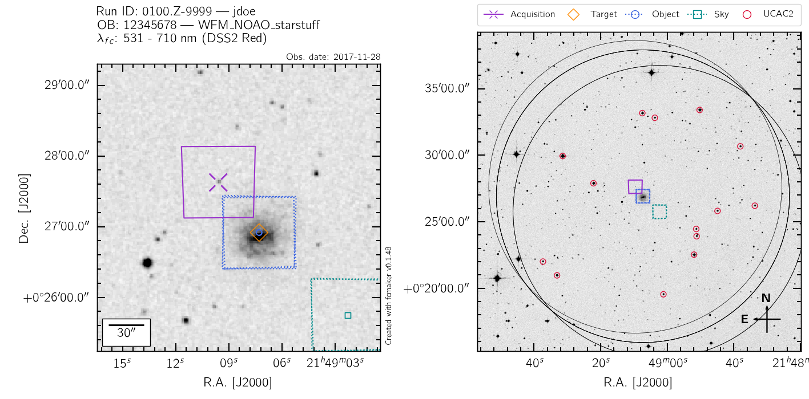
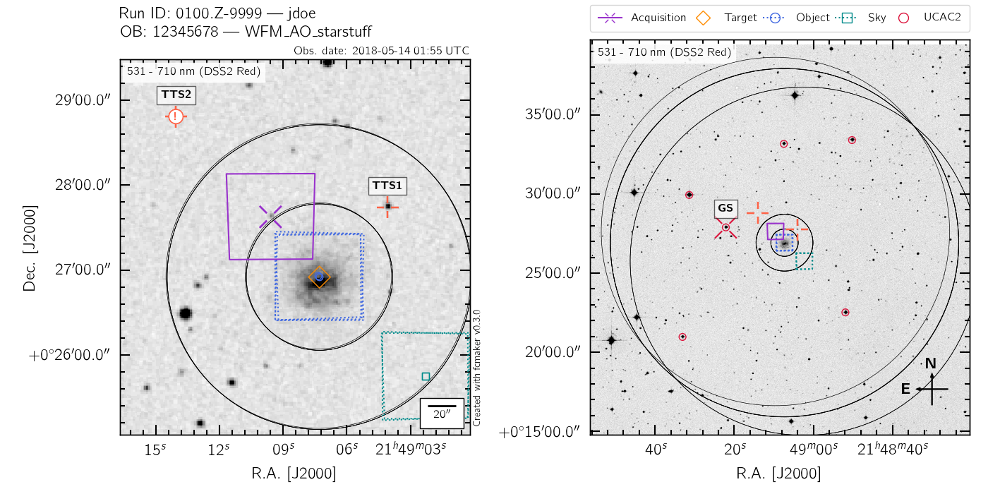
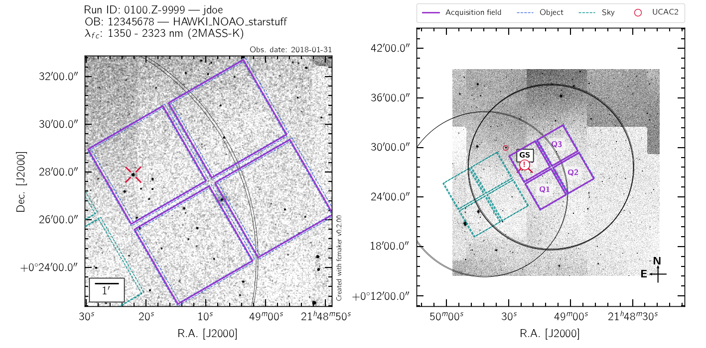
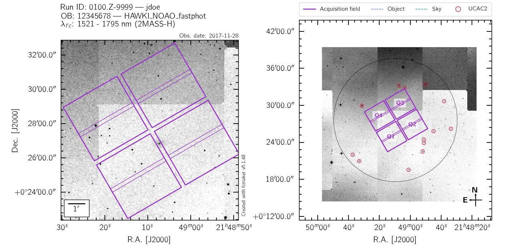

.. _gallery:

Gallery
=======

MUSE
----

MUSE WFM-NOAO
.............

The MUSE finding charts in NOAO mode show the location of the *target* defined in the OB, 
the acquisition field, and the subsequent O and S fields. In the large view, all UCAC2
stars with 11<UCmag<15 are tagged with red circles: these stars are the ones that fit the 
nominal VLT GS specifications, and can be readily selected by the Telescope Operator during the
OB acquisition. Only the Guide Stars compatible with all the OB offsets are tagged. The 
black circles are 11 arcmin in radius, and trace the allowed GS search area. If specified, 
the user selected guide star is also shown. If the selected GS is unsuitable for any of the 
offset positions, it will be flagged accordingly. 

To recreate this example finding chart, download 
:download:`local_2_fcm.muse_wfm-noao <./local_2_fcm.muse_wfm-noao>` and run::
   
   python -m fcmaker -l -f local_2_fcm.muse_wfm-noao --do-png

MUSE WFM-AO
...........

In addition to the elements of the MUSE NOAO charts, the AO charts display the validity 
area for the Tip-Tilt stars for all OB offsets (incl. the target itself, which is when the
AO loop is first closed). If one of the TTS falls outside of the suitable area for any of
the offset position, it is flagged with ``!``. 

To recreate this example finding chart, download 
:download:`local_2_fcm.muse_wfm-ao <./local_2_fcm.muse_wfm-ao>` and run::
   
   python -m fcmaker -l -f local_2_fcm.muse_wfm-ao --do-png

HAWKI
-----

HAWKI NOAO
..........

The HAWKI finding charts in NOAO mode show the acquisition field, and the subsequent O and 
S fields if the ``HAWKI_img_obs_GenericOffset`` template is used. In the large view, all 
UCAC2 stars with 11<UCmag<15 are tagged with red circles: these stars are the ones that 
fit the nominal VLT GS specifications, and can be readily selected by the Telescope 
Operator during the OB acquisition. Only the Guide Stars compatible with all the OB offsets 
are tagged. The black circles are 11 arcmin in radius, and trace the allowed GS search 
area. If specified, the user selected guide star is also shown. If the selected GS is 
unsuitable for any of the offset positions, it will be flagged accordingly. 

To recreate this example finding chart, download 
:download:`local_2_fcm.hawki_noao <./local_2_fcm.hawki_noao>` and run::
   
   python -m fcmaker -l -f local_2_fcm.hawki_noao --do-png

HAWKI NOAO FastPhot
...................

In addition to the elements of the HAWKI NOAO charts, the FastPhot charts display the  
detector windowed area. 

To recreate this example finding chart, download 
:download:`local_2_fcm.hawki_fph <./local_2_fcm.hawki_fph>` and run::
   
   python -m fcmaker -l -f local_2_fcm.hawki_fph --do-png

